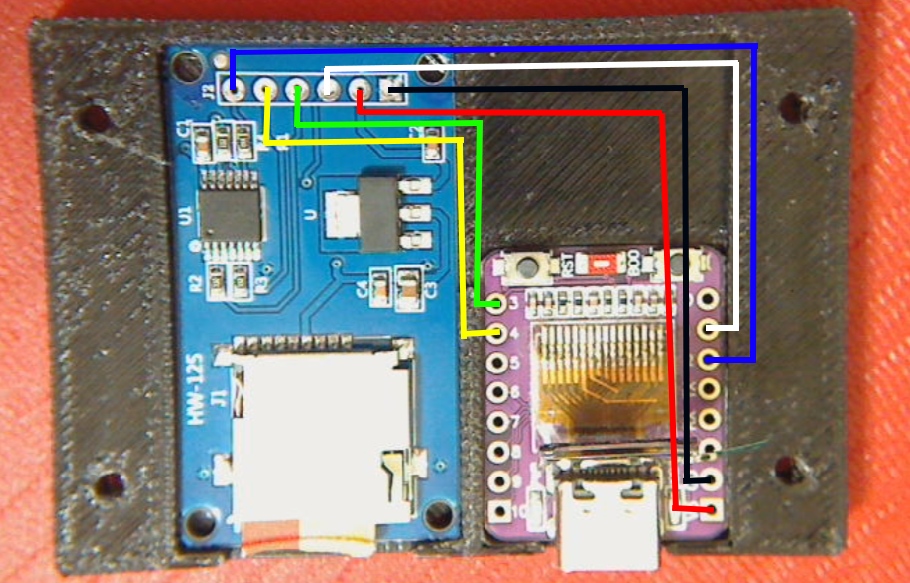

# 📡 Standalone Automated Wardrive Log Uploader Node

An automated, standalone hardware companion key designed to process, securely transmit, and clean wardrive logs collected from **2.8" Cheap Yellow Display (CYD) ESP32 Marauder** units and dual-band **ESP32-C5 Biscuit App rigs**.

This project bypasses the CYD's inherent hardware limitations (shared SPI data buses and lack of external PSRAM) by offloading the entire encrypted HTTPS wireless network pipeline onto a streamlined **ESP32-C3 Supermini OLED** box.

---

## 🛠️ The Problem this Solves
The legacy CYD architecture wires the microSD card module, touch matrix layer, and TFT drawing panel to the exact same physical SPI hardware pins. Attempting a secure TLS/SSL data handshake over Wi-Fi exhausts the chip's internal unfragmented RAM pool, freezing the device indefinitely at **0%** during uploads.

**The Solution:** This pocket node acts as a headless companion key. At the end of a trip, simply slide the card out of your tracker and insert it into this device. Powered strictly over USB-C, it executes a high-speed simultaneous payload push, indexes the data, and cleans the card automatically.

---

## ⚙️ Post-Installation Configuration

Before flashing the code to your **ESP32-C3 Supermini**, you must open the source `.ino` sketch file and modify the **`USER CONFIGURATION`** block (Lines 9 through 17) to match your own physical network credentials and personal database routing tokens. Leaving the default placeholder values active will cause immediate Wi-Fi connection and upload handshake failures.

### 📱 1. Network Credentials Layout
* `WIFI_PRIMARY_SSID` / `WIFI_PRIMARY_PASS`: Enter the exact name and password of your primary home router network (2.4 GHz band mandatory).
* `WIFI_SECONDARY_SSID` / `WIFI_SECONDARY_PASS`: Enter the configuration details of your **smartphone's mobile hotspot**. 
  * *Pro-Tip:* Set your phone hotspot's configuration parameter to **"Maximize Compatibility"** (or force a fixed 2.4 GHz channel index) to ensure the miniature C3 trace antenna establishes a clean connection link on the road.

### 🔑 2. Database API Keys Mapping
To retrieve your unique upload tokens, sign into your personal tracking accounts on a web browser and capture the following parameters:
* **WiGLE Keys:** Navigate to your **WiGLE API Tokens** settings page. Generate an API pair. Paste your long alphanumeric API Name directly into `WIGLE_USER`, and your corresponding secret key into `WIGLE_TOKEN`.
* **WDGWars Token:** Log into your profile layout, head to settings, and locate your **64-character hex API key**. Copy the entire string value and paste it cleanly inside the `WDG_API_KEY` parameter quotes.

---

## 🚀 Intelligent Operation Workflow Sequence
The onboard 0.42" display and the verbose Serial Monitor (115200 baud) guide you through the automated sequence:
1. `[SYSTEM] Booting Up...` — Maps the native hardware matrices and initializes the USB CDC stream.
2. `[SYSTEM] SD Card initialized cleanly.` — Mounts the file storage registry blocks.
3. `[WIFI] Connected cleanly!` — Establishes an encrypted wireless handshake over your active hotspot.
4. `[QUEUE FOUND]` — Scans the root directory for target files (`.log` or `.csv` files).
5. `Streaming file payloads...` — Pipes data blocks over high-speed **512-byte chunking buffers** to feed network streams cleanly without underruns.
6. `[SYNC COMPLETE]` — Cleanly purges the local log file *only* after getting verified receipt tokens.
7. `[DUPLICATE DISCOVERY]` — Smart fallback net automatically clears out files already hosted on the servers to break endless loops.

---

## 📐 Hardware Architecture & Connection Blueprint

### Required Components:
* **Microcontroller:** ESP32-C3 Supermini with Onboard 0.42" SSD1306 OLED (Yong Tai Fa / d-zon layout)
* **Storage Board:** Standard Micro SD Card Breakout Module (SPI configuration with built-in level shifter)
* **Enclosure:** Custom 3D Printed Pocket Shell (STL mesh layouts included in repository)

### Undersurface Solder Configuration:

| Micro SD Module Pin | ESP32-C3 Supermini Board Pin | Function Type | Wire Color Profile |
| :--- | :--- | :--- | :--- |
| **GND** | **GND / GD** | Ground Loop | Black Wire |
| **VCC** | **5V / V5** | Input Power | Red Wire |
| **MISO** | **GPIO 1** | Hardware SPI Data In | White Wire |
| **MOSI** | **GPIO 3** | Hardware SPI Data Out | Green Wire |
| **SCK** | **GPIO 4** | Hardware SPI Clock | Yellow Wire |
| **CS** | **GPIO 2** | Hardware SPI Chip Select | Blue Wire |

*Note: The built-in 0.42" OLED panel is hardwired by the factory directly to **GPIO 5 (SDA)** and **GPIO 6 (SCL)**, keeping the display totally isolated from your card data lines to prevent bus collisions.*

---

## 💻 Arduino IDE Compiler Setup Settings
To compile the firmware source code cleanly onto the C3 processor chip, use the following options under **Tools**:
* **Board Core:** `esp32 by Espressif Systems (v3.3.12 or newer)`
* **Board Target:** `ESP32C3 Dev Module`
* **USB CDC On Boot:** `Enabled` ⚠️ *(Mandatory to activate active tracking feeds over your serial port monitor)*
* **Partition Scheme:** `Huge APP (3MB No OTA / 1MB SPIFFS)`

---

## 🤝 Community Credits & Upstream Attributions
This project is an open-source companion utility built upon the incredible foundations paved by the network mapping community:
* **ESP32 Marauder:** Framework created by **JustCallMeKoko**.
* **The Biscuit App:** Dual-band environment created by **Alexandre01**.
* **U8g2 Graphics Engine:** Vector font mapping modules written by **olikraus**.
* **Visual Map Targets:** Deep thanks to the engineering teams running **WiGLE.net** and **WDGWars.pl**.

---

## 📄 Open-Source License
Distributed under the high-permissibility open-source **MIT License**. See the accompanying `LICENSE` file for full terms.

*Figure 1: Complete 6-wire physical undersurface solder trace schematic mapped across the active hardware components.*

